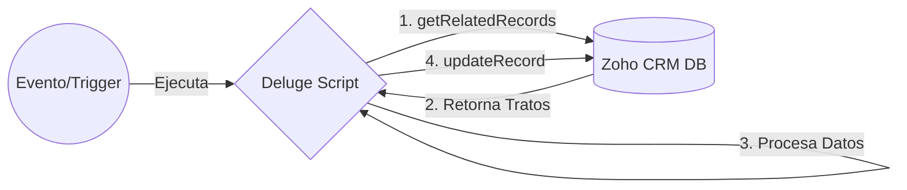
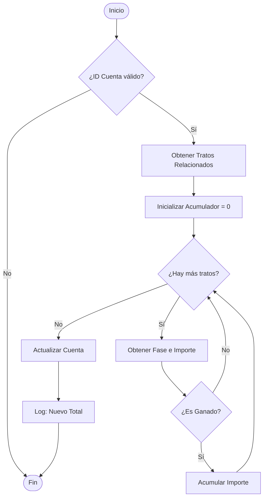

# Documentación Técnica: Cálculo de Ventas Históricas

## Arquitectura del Script
El script actúa como un proceso de backend dentro de Zoho CRM (Deluge), diseñado para ejecutarse de manera asíncrona o activada por eventos (Workflows/Schedules). Su función principal es agregar datos financieros de registros hijos (Tratos) hacia un registro padre (Cuenta).

### Componentes Clave
1.  **Trigger**: Evento que dispara la ejecución (ej. cierre de un trato o actualización programada).
2.  **API Client**: `zoho.crm` namespace para interactuar con la base de datos.
3.  **Lógica de Negocio**: Filtrado de estados y aritmética simple.
4.  **Persistencia**: Escritura del resultado en el campo personalizado de la Cuenta.

### Diagrama de Arquitectura
El siguiente esquema muestra la interacción entre los componentes del sistema:

## Diagrama de Flujo
El siguiente diagrama ilustra la lógica de decisión y el flujo de datos del script.

## Especificaciones Técnicas

### Entradas (Inputs)
| Variable | Tipo | Descripción | Requerido |
| :--- | :--- | :--- | :--- |
| `id_cuenta` | `BigInt` / `String` | ID único del registro en el módulo **Accounts**. | Sí |

### Salidas (Outputs)
| Acción | Descripción |
| :--- | :--- |
| **Actualización de Registro** | Modifica el campo `Total_Ventas_Hist_ricas` en el módulo **Accounts**. |
| **Logs del Sistema** | Imprime el valor final calculado mediante `info`. |

## Dependencias del Esquema
| Módulo | Campo (API Name) | Tipo de Dato | Uso |
| :--- | :--- | :--- | :--- |
| **Accounts** | `Total_Ventas_Hist_ricas` | Currency / Decimal | Campo destino para el valor calculado. |
| **Deals** | `Stage` | Picklist | Criterio de filtrado (Ganado vs Perdido). |
| **Deals** | `Amount` | Currency | Valor a sumar. |
